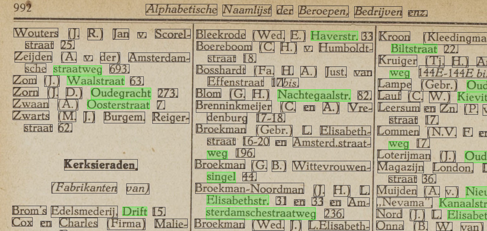

# Experimenten voor snel kunnen selecteren voor Markeren/Annoteren/Taggen van gegevens in scans.

Mensen kunnen snel patronen herkennen in de structuur van een (gescand) document. Wij zien bijv heel snel dat in de hieronderstaande afbeeldingen alle namen linksuitgelijnd precies onder elkaar staan, direct gevolgd door een beroep met daartussen een comma. In de tweede afbeelding zien we al heel snel dat daar de pagina onderverdeeld is in 3 kolommen en dat de voorletters van een naam tussen haakjes staan.

Voor computers zijn deze patronen tot nu toe nog een stuk moeilijker te herkennen al wordt hier uiteraard een hoop onderzoek naar gedaan in de wereld van AI en machine learning.

Dit experiment (een Processing script zonder AI) probeert een aantal technieken uit waarbij de mens en de computer samenwerken om snel - met zo weinig mogelijk repeterende handelingen - de structuur van gegevens in een pagina te herkennen/aan te geven.

Het is een levend script dat steeds wordt aangepast en wordt voorzien van nieuwe regels (als in 'rules') die tot nu toe onder sneltoetsen zijn ondergebracht. Uiteindelijk moeten de regels in herbruikbare blokjes na elkaar kunnen worden uitgevoerd als Macro's die tot je beschikking staan en waarbij je telkens kunt ingrijpen en sturen.

> Vraag aan wie dit leest: Er moeten hier toch wel haast bestaande krachtige tools voor bestaan? Stuur aub een bericht of maak een issue aan als je goede voorbeelden kent.

## Via selectie met de muis woorden markeren als naam, adres, beroep

## Via regular expressions of andere string functies matchen (bijv op haakjes)

## Via lookup-tables met namen, straten en beroepen automatisch woorden markeren
namen:

straten:

