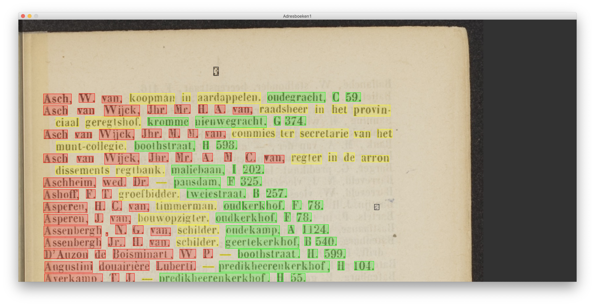
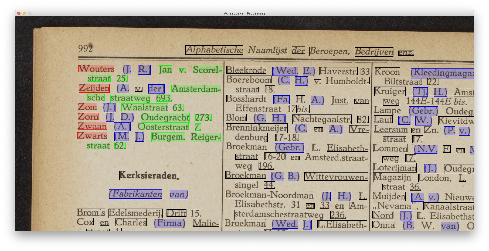
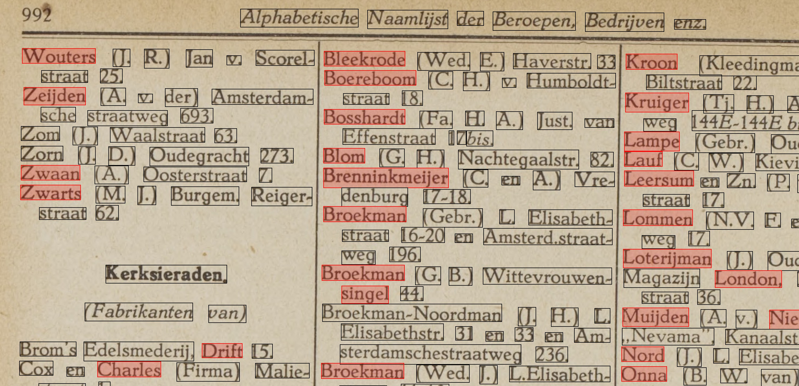

# Via selectie met de muis woorden markeren als naam, adres, beroep

# Via regular expressions of andere string functies matchen (bijv op haakjes)

# Via lookup-tables met namen, straten en beroepen automatisch woorden markeren
namen:

straten:

## Annotorius
Ook nuttig om te bekijken voor als je een oplossing zoekt die in de webbrowser werkt: https://recogito.github.io/annotorious/getting-started/web-annotation/

